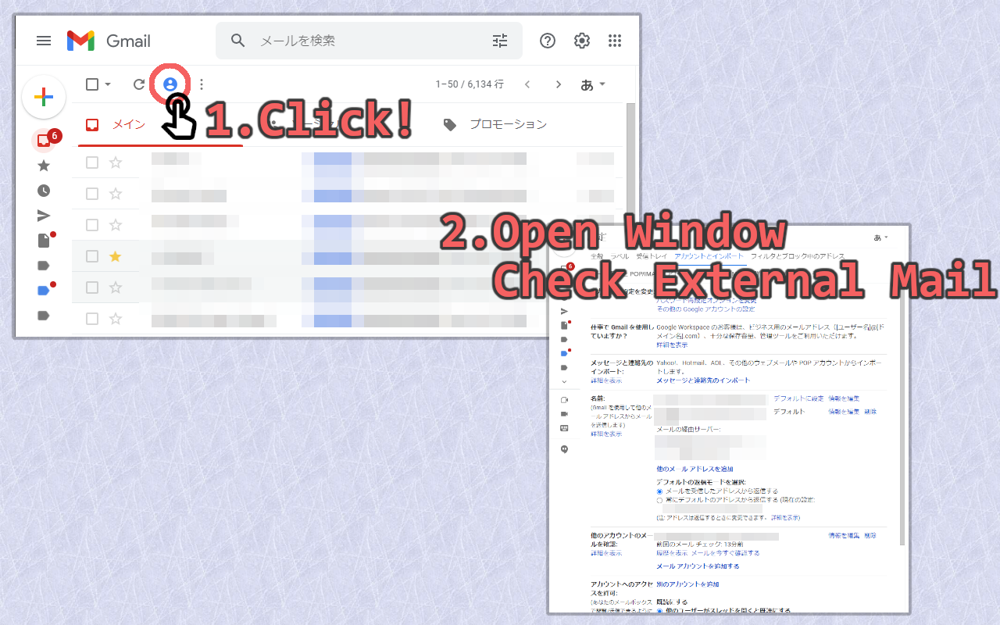

# Gmail: Check External Mail

## Abstract

With this extension on Gmail, you can easily check new mail arrival for imported accounts. 

この拡張機能により、Gmailへインポートされたアカウントの新着メール確認が簡単なります。

**This extension is pre-alpha version, so there may be some bugs**. If you find them, please contact me with email or Google Forms.

**この拡張機能はpre-Alpha版であり、バグが残っている可能性があります。** もし発見した場合は、emailやGoogle Formsから連絡していただけると幸いです。

## Usage

By clicking added button  newxt to refresh button , a new temporary window will be opened with new mail arrival for imported accounts checked. 
After that, the open window will be automatically closed and then mail box will be refreshed.

更新ボタン  のとなりに追加されているボタン  を押すと、新しい一時ウィンドウが立ち上がり、そこでインポートされているアカウントの新着メールの確認が行われます。
その後、ウィンドウが閉じられてメールボックスが更新されます。

## Future Work

- add option page where you can manage the texts to identify elements of HTML on Gmail. This enable you to use in any language. (In default, this extension works in English and Japanese.)

## Contact

Google Forms: https://docs.google.com/forms/d/e/1FAIpQLSdh2wRCUWpX6ZLfma-g5O46eD93wOPHpDHWQGxdOcJLmm_tGQ/viewform?usp=pp_url&entry.1848091360=Gmail:+Check+External+Mail
Mail: TomoIris427+GitHub@gmail.com

## License

MIT
